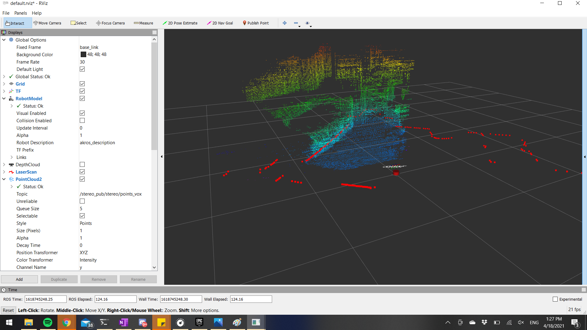
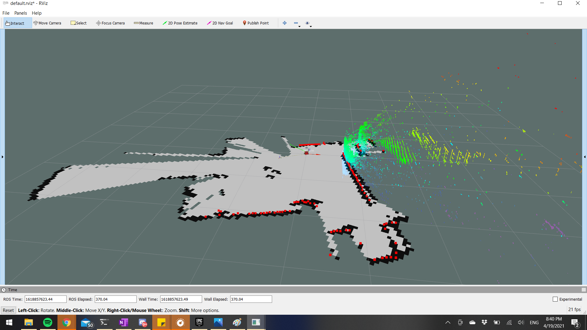

https://github.com/ros-perception/pointcloud_to_laserscan/tree/humble

this package helps in converting the live PCl data coming from the 3D Li-DaR to a LaserScan format. Basically it converts the the yopic format.

It compresses the data from 3D to 2d using 2 different methods:
1. crops the data. 
2. projects the leftover data to XY plane

### Key Idea

Many robots use **2D LiDAR-based algorithms** (like SLAM and localization).  
However, modern sensors often produce **3D point clouds**.

This package allows robots to:

- Use **3D LiDAR / depth cameras**
- But still run **2D laser-based navigation algorithms**

---

## 1. Main Functional Components

The package contains **two ROS2 nodes**:

1. **PointCloudToLaserScanNode**
    
2. **LaserScanToPointCloudNode**
    

Each node converts data between two ROS message types.

---

## 2. PointCloudToLaserScanNode

### Purpose

This node converts:

sensor_msgs/PointCloud2  →  sensor_msgs/LaserScan
It **projects a 3D point cloud onto a 2D plane** to simulate a laser scan.

### Example Use Case

A robot has a **3D LiDAR**, but the navigation stack requires a **2D laser scan**.

Workflow:

3D LiDAR  
   ↓  
PointCloud2  
   ↓  
pointcloud_to_laserscan node  
   ↓  
LaserScan  
   ↓  
SLAM / Navigation

This allows compatibility with:
- AMCL localization   
- 2D SLAM
- Navigation2 stack

### Subscribed Topics

The node subscribes to:
`cloud_in (sensor_msgs/msg/PointCloud2)`

This topic contains the **3D point cloud input**.

Important behavior:
- The node processes data **only when someone subscribes to the output scan topic**.

This avoids unnecessary computation.

### Published Topics
The node publishes:
`scan (sensor_msgs/msg/LaserScan)`

---

## 3. Conversion Algorithm (Conceptual)

The conversion follows these steps:

### Step 1 — Receive Point Cloud

The node receives a **3D point cloud** containing many points:

(x, y, z)

---

### Step 2 — Height Filtering

Points outside a specific **vertical range** are removed.

Parameters:

min_height  
max_height

This isolates a **horizontal slice** of the environment.

---

### Step 3 — Angle Calculation

Each point is converted into **polar coordinates**:

angle = atan2(y, x)  
distance = sqrt(x² + y²)

---

### Step 4 — Angular Binning

The scan space is divided into **angular bins**.

Example:

angle_min = -π  
angle_max = π  
angle_increment = 1°

Each bin represents **one laser beam**.

---

### Step 5 — Closest Point Selection

For each angle bin:
- The **closest point** is chosen.
- That distance becomes the **laser range**.

This mimics how a real LiDAR works.

---

### Step 6 — Publish LaserScan

The node generates a **LaserScan message** containing:

- angle range
- range measurements
- scan timing
- frame information

---

## 4. Key Parameters of PointCloudToLaserScanNode

These parameters control the conversion behavior.

---

### 1. Height Filtering

### `min_height`

Minimum height of points to consider.

Removes points below ground.

---

### `max_height`

Maximum height of accepted points.

Removes ceiling points.

---

### 2. Angular Limits

### `angle_min`

Minimum scan angle.

### `angle_max`

Maximum scan angle.

### `angle_increment`

Resolution of the scan.

---

### 3. Range Limits

### `range_min`

Minimum measurable distance.

### `range_max`

Maximum measurable distance.

---

### 4. Frame Transformation

### `target_frame`

Transforms the point cloud into another coordinate frame before conversion.

---

### `transform_tolerance`

Allowed delay when looking up transforms.

---

### 5. Output Behavior

### `use_inf`

Controls how empty ranges are represented.

If enabled:

range = +∞

Otherwise:

range = range_max + 1

---

### 6. Queue Size

### `queue_size`

Controls how many messages are buffered.

Default:

number of CPU cores

---

### 7. Scan Time

### `scan_time`

Defines how long a full scan takes.
Used only to populate the LaserScan message.

---

## 5. Repository Structure

The repository contains typical ROS2 package files.

pointcloud_to_laserscan/  
│  
├── include/  
│   └── pointcloud_to_laserscan  
│  
├── src/  
│   ├── pointcloud_to_laserscan_node.cpp  
│   ├── laserscan_to_pointcloud_node.cpp  
│  
├── launch/  
│   └── launch files  
│  
├── CMakeLists.txt  
├── package.xml  
├── README.md  
└── LICENSE

---

## 6. Using 3D LiDAR with 2D Navigation

Many navigation stacks expect **LaserScan**.

Example:

3D LiDAR  
   ↓  
PointCloud2  
   ↓  
pointcloud_to_laserscan  
   ↓  
LaserScan  
   ↓  
Nav2

---

## 7. Limitations

### Information Loss

Converting **3D → 2D** removes vertical information.

Example:
- Overhang obstacles
- Multi-level objects

---

### Assumes Flat Environment

Works best for:
- indoor robots
- ground robots

Not ideal for aerial robots.

---

