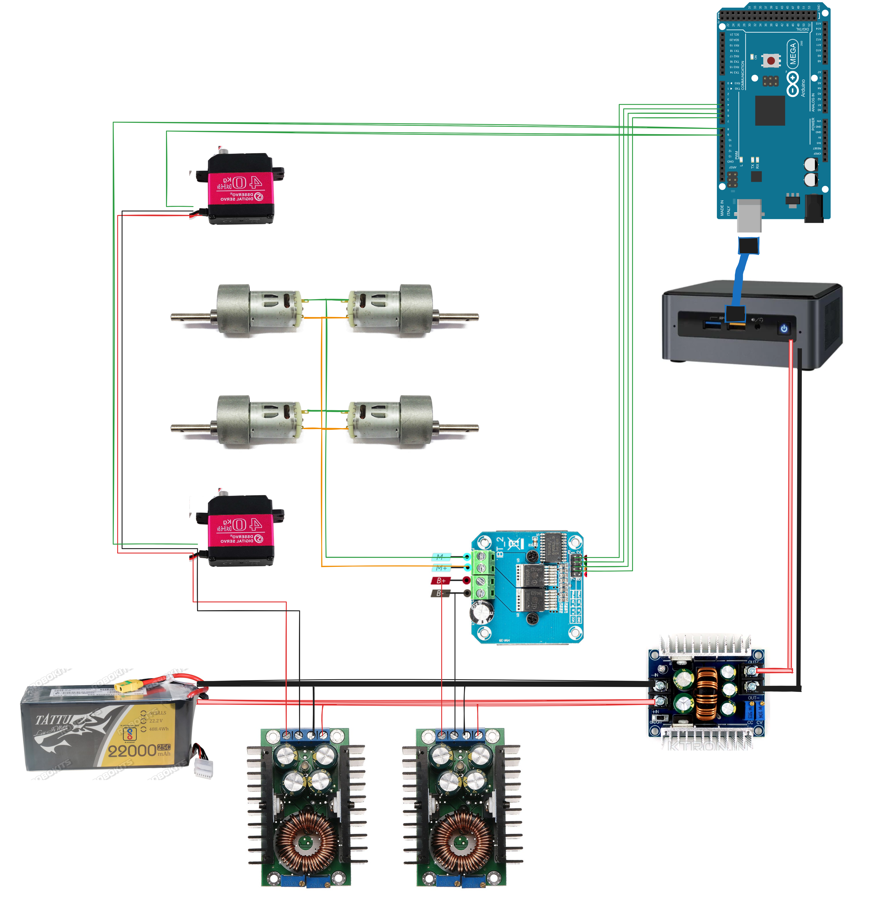

| Motor Driver Pin | Arduino |
| ---------------- | ------- |
| RPWM             | D6      |
| LPWM             | D7      |
| R_EN             | D4      |
| L_EN             | D5      |
| VCC              | 5V      |
| GND              | GND     |

| Motor Driver           | Connect to |
| ---------------------- | ---------- |
| B+ / VCC (motor power) | Battery +  |
| B- / GND               | Battery -  |
| Motor terminals        | Your motor |

| Servo Wire      | Arduino             |
| --------------- | ------------------- |
| Signal (servo1) | D8                  |
| Signal (servo2) | D9                  |
| VCC             | 5V (Buck convertor) |
| GND             | GND                 |

## 🎮 Channel Mapping (FS-i6)

|Channel|Function|
|---|---|
|CH1|Servo 2 (steering?)|
|CH2|Direction (forward/back)|
|CH3|Speed (throttle)|
|CH4|Servo 1|
